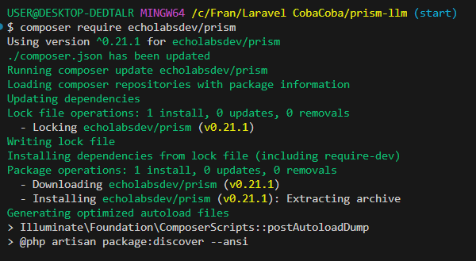
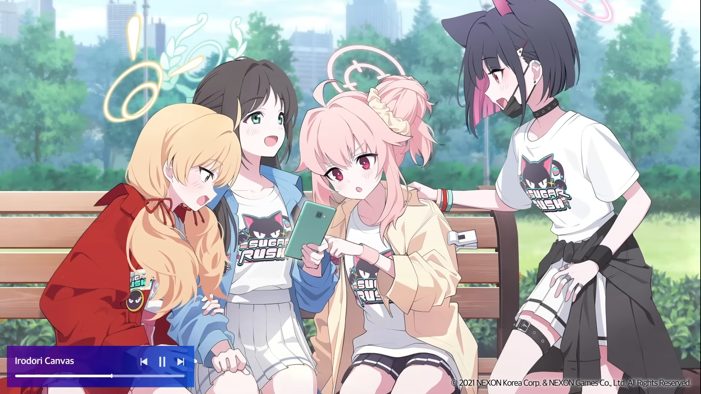

# Prism: Laravel-LLM

## Installation

It’s not special, you just follow this tutorial.

[https://prism.echolabs.dev/getting-started/installation.html](https://prism.echolabs.dev/getting-started/installation.html)

### image




## Config

If you want to “try”, I recommend using Groq because you don’t need Credit Card to access it.

[https://groq.com/](https://groq.com/)


```
GROQ_API_KEY="insert_your_groq_api_key"
```

## How to Use

Follow this instruction

[https://prism.echolabs.dev/core-concepts/text-generation.html](https://prism.echolabs.dev/core-concepts/text-generation.html)

Example


### image


## Using to Identify Image


So, can LLM identify this picture, especially identify the girl with white hair.

Prompt:

```
Descriptions about the girl in this picture
```

- groq
    
    Model:
    
    llama-3.2-11b-vision-preview
    
    
    
    If I use normal model (without support image preview) a.k.a llama3-8b-8192, the result will like this.
    
    
    
- xai
    
    model:
    
    grok-2-vision-1212
    
    
    

## Creating Via Command

Create command

```bash
php artisan make:command AskAi
```

Signature for execute the command. You can replace ‘ai:ask’ to anything what you want.

```php
protected $signature = 'ai:ask';
```

- The Code
    
    ```php
    /**
     * Execute the console command.
     */
    public function handle()
    {
        /**
         * Example usage of the Prism library to generate a response from Groq in simple way
         */
    
        // Ask user for input
        $question = textarea('Something in your mind?');
    
        $answer = Prism::text()
            ->using(Provider::Groq, 'llama3-8b-8192')
            // ->withSystemPrompt('You are an expert historian who explains concepts simply.') // You can remove this line if you don't want to use system prompt
            ->withPrompt($question)
            ->generate()
            ->text;
    
        // Output the answer
        $this->info($answer);
    }
    ```
    

Excute command

```bash
php artisan ask:ai
```


## Identify Image Via Command

Creating command first

After that, you can use this code

- Code
    
    ```php
    /**
     * Execute the console command.
     */
    public function handle()
    {
        /**
         * Example usage for image messages
         * ! For now I recommend using via URL
         */
    
        $image = textarea('Enter the URL of the image to review:');
    
        // From a local file
        // $message = new UserMessage(
        //     "What's in this image?",
        //     [Image::fromPath('img/assc.jpg')]
        // );
    
        // From a URL
        $message = new UserMessage(
            'Descriptions about something in this picture',
            [Image::fromUrl($image)]
        );
    
        // From a Base64
        // $image = base64_encode(file_get_contents('img/assc.jpg'));
    
        // $message = new UserMessage(
        //     'Analyze this diagram:',
        //     [Image::fromBase64($image, 'jpeg')]
        // );
    
        $answer = Prism::text()
                    ->using(Provider::Groq, env('GROQ_MODEL_FOR_IMAGE'))
                    ->withMessages([$message])
                    ->generate()
                    ->text;
    
        $this->info($answer);
    }
    ```
    


## Creating Chat Via Command

- Code
    
    ```php
    /**
     * Array of messages
     */
    private $messages = [];
    
    /**
     * Execute the console command.
     */
    public function handle()
    {
        /**
         * Example usage of the Prism library to generate a response from Groq in simple way
         */
    
        while (true) {
            // Ask user for input
            $question = textarea('Something in your mind?');
    
            // Add user message to the array of messages
            $this->messages[] = new UserMessage($question);
    
            $answer = Prism::text()
                ->using(Provider::Groq, env('GROQ_MODEL'))
                // ->withSystemPrompt('You are an expert historian who explains concepts simply.') // You can remove this line if you don't want to use system prompt
                ->withMessages($this->messages)
                ->generate()
                ->text;
    
            // Output the answer
            $this->info($answer);
    
            // Add assistant message to the array of messages
            $this->messages[] = new AssistantMessage($answer);
        }
    }
    ```
    


## Review Image Via Command

### From Local

```php
$message = new UserMessage(
    "What's in this image?",
    [Image::fromPath('public/img/assc.jpg')]
);

$answer = Prism::text()
            ->using(Provider::Groq, env('GROQ_MODEL_FOR_IMAGE'))
            ->withMessages([$message])
            ->generate()
            ->text;

$this->info($answer);
```

- Image
    
    
    


### From Base64

```php
// From a Base64
$image = base64_encode(file_get_contents('public/img/assc.jpg'));

$message = new UserMessage(
    'Analyze this image:',
    [Image::fromBase64($image, 'jpeg')]
);

$answer = Prism::text()
            ->using(Provider::Groq, env('GROQ_MODEL_FOR_IMAGE'))
            ->withMessages([$message])
            ->generate()
            ->text;

$this->info($answer);
```

- Image
    
    
    


### From URL

```php
// From a URL
$message = new UserMessage(
    'Descriptions about something in this picture',
    [Image::fromUrl($image)]
);

$answer = Prism::text()
            ->using(Provider::Groq, env('GROQ_MODEL_FOR_IMAGE'))
            ->withMessages([$message])
            ->generate()
            ->text;

$this->info($answer);
```

- Image
    
    
    


## Using Tools Via Command

Step by step

You can copy paste this step and set api_key to your serpapi api key

[https://prism.echolabs.dev/core-concepts/tools-function-calling.html#complex-tool-implementation](https://prism.echolabs.dev/core-concepts/tools-function-calling.html#complex-tool-implementation)

### Code

```php
<?php

namespace App\Tools;

use EchoLabs\Prism\Tool;
use Illuminate\Support\Facades\Http;

class SearchTool extends Tool
{
    public function __construct()
    {
        $this
            ->as('search')
            ->for('useful when you need to search something')
            ->withStringParameter('query', 'Detail search query')
            ->using($this);
    }

    public function __invoke(string $query): string
    {
        // dd('test');
        $response = Http::get('https://serpapi.com/search', [
            'engine' => 'google',
            'q' => $query,
            'google_domain' => 'google.com',
            'gl' => 'us',
            'hl' => 'en',
            'api_key' => env('SERPAPI_API_KEY')
        ]);

        $results = collect($response->json('organic_results'));

        $results = $results->map(function ($result) {
            return [
                'title' => $result['title'],
                'link' => $result['link'],
                'snippet' => $result['snippet'],
            ];
        })->take(4);

        return view('prompts.search-tool-results', [
            'results' => $results
            ])
            ->render();

    }
}

```

```
<links>
    @foreach ($results as $result)
        <link>
            <title>{{ $result['title'] }}</title>
            <url>{{ $result['link'] }}</url>
            <snippet>{{ $result['snippet'] }}</snippet>
        </link>
    @endforeach
</links>

ALWAYS CITE SOURCES AT THE END OF YOUR RESPONSE

<example-sources>

</example-sources>

```

```php
private $messages = [];

/**
 * Execute the console command.
 */
public function handle()
{
    /**
     * Example usage of the Prism library to generate a response from Groq in simple way
     */

    while (true) {
        // Ask user for input
        $question = textarea('Something in your mind?');

        // Add user message to the array of messages
        $this->messages[] = new UserMessage($question);

        $answer = Prism::text()
                        ->withTools([
                            new SearchTool(),
                        ])
                        ->withMaxSteps(5)
                        ->withMessages($this->messages)
                        ->using(Provider::Groq, env('GROQ_MODEL'))
                        ->generate()
                        ->text;

        // Output the answer
        $this->info($answer);

        // Add assistant message to the array of messages
        $this->messages[] = new AssistantMessage($answer);
    }

}
```


### Why Using Search Tools Like Serpapi?

Serpapi can help you to give AI new knowledge based on search engine.

Example

If I use serpapi


Without serpapi


So, who is true?

Well, nobody is true, but with serpapi will close to the truth. 


---

## Example Using Another LLM

This is example from my experiences. 

I want to choose LLM if this LLM don’t need Credit Card. Honestly, I don’t want to fill credit card input for development. 

### OpenAI

[https://openai.com/api/](https://openai.com/api/)


- Why didn’t use OpenAI?
    
    
    
    You need Credit card :”
    
    
    

### Antropic

[https://console.anthropic.com/dashboard](https://console.anthropic.com/dashboard)

- Why?
    
    
    
    You need buy credits.
    
    
    

### Ollama


- Why I don’t use it?
    
    Maybe I’ll use it later if I can’t found any LLM that I like
    

### Mistral AI


- Why I didn’t use it?
    
    
    
    Add your payment information.
    
    Maybe. I’m don’t login for now. But, I thought I’ll skip it.
    

### Groq

[https://groq.com/](https://groq.com/)


- Why use it?
    
    You don’t need payment and credit card. Honestly, for development only, I’m little care about rate limit. 
    

### XAI

[https://x.ai/](https://x.ai/)


- Why I don’t use it?
    
    
    
    You have limited credits. Maybe, I’ll use it later if I want.
    
    Note: I use it in image preview
    
- Example
    
    
